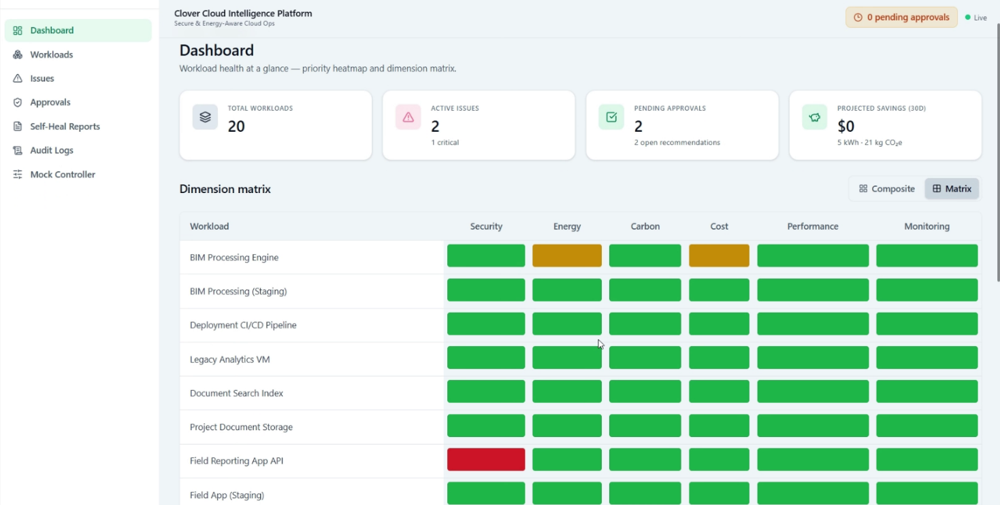
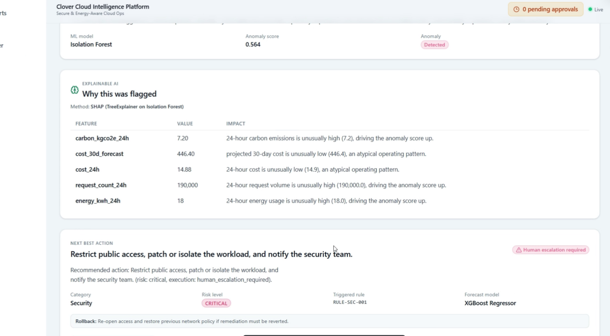
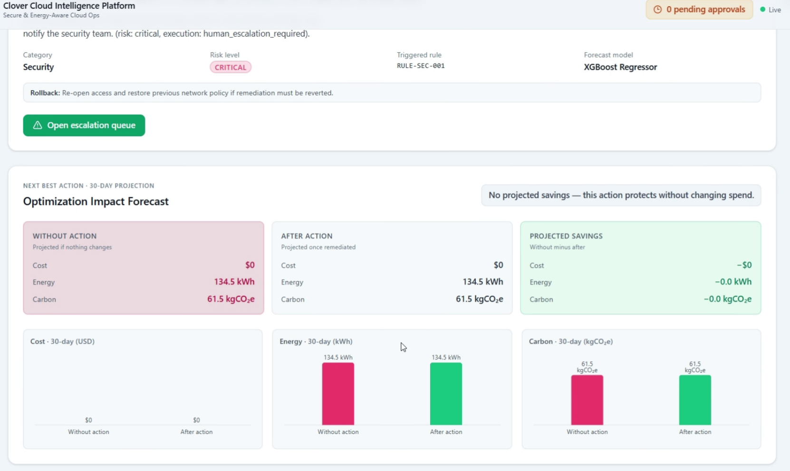
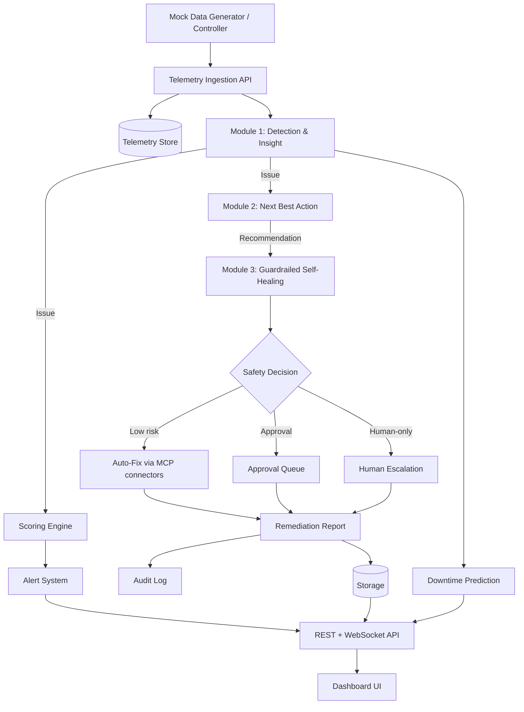

# 🍀 Clover — Secure, Energy-Aware Cloud Intelligence Platform

> **ImagineHack 2026 · Track 2 by HILTI — Secure & Energy-Aware Cloud Platforms for Construction Tech**

Clover is an **explainable AI decision layer** for construction-tech cloud workloads. It
continuously monitors telemetry, **detects** anomalies and inefficiencies, **explains why they
matter**, recommends the **next best action** with a projected cost / energy / carbon forecast, and
then **safely auto-fixes, asks for approval, or escalates** through a guardrailed remediation
workflow — with a full audit trail.

```text
Detect clearly.        Isolation Forest + SHAP + rules
Recommend safely.      rule-based Next Best Action + XGBoost forecast
Fix responsibly.       guardrailed self-healing, human-in-the-loop
Report transparently.  remediation reports + immutable audit log
```

> **MVP honesty:** there is no access to real HILTI infrastructure. Everything runs on
> **synthetic cloud telemetry** from a live mock data generator. Models are trained and demonstrated
> on synthetic data — this is how the system behaves once connected to real cloud telemetry.

---

## Table of contents

- [Why Clover](#why-clover)
- [Team Members](#team-members)
- [Challenge and Approach](#challenge-and-approach)
- [Screenshots](#screenshots)
- [Architecture](#architecture)
- [Tech stack](#tech-stack)
- [Repository layout](#repository-layout)
- [Quick start](#quick-start)
- [Configuration](#configuration)
- [Testing](#testing)
- [Documentation](#documentation)
- [License](#license)

---

## Why Clover

Construction-tech runs on cloud workloads — field apps, project dashboards, IoT monitoring, BIM
processing, reporting, document storage, databases, CI/CD. Once deployed, these become blind spots:
teams cannot continuously connect **security risk + energy use + carbon impact + cloud cost +
workload efficiency + construction-workflow importance** into one decision layer.

Clover unifies all of those signals and turns them into safe, explainable action.

| Track outcome | How Clover addresses it |
|---|---|
| Improved cloud security | Detect exposed services, public storage, vulnerabilities, access anomalies |
| Reduced energy consumption | Find idle / overprovisioned / inefficient workloads |
| Lower carbon footprint | Forecast carbon and recommend lower-carbon optimization |
| Automated alerts | Threshold-based alert system with suppression / retry / SLA |
| Smart recommendations | Rule-based Next Best Action engine |
| Cost optimization | XGBoost projected-savings forecast + optimization workflow |
| Continuous optimization | Monitoring loop, repeated telemetry ingestion, self-healing cycle |
| Construction workflow support | Workflow criticality factored into prioritization |
| Operational efficiency | Auto-fix, approval workflow, escalation, audit reports |

---

## Team Members

| Name | Role | Programme |
|---|---|---|
| Muhammad Izzul Islam bin Faisal | Project Lead & Explainable AI Specialist | Bachelor of Computer Science (Data Science) with Honours |
| Muhammad Nur Amjadh Bin Asabdeen | Software Engineering Lead | Software Engineering with Honours student |
| MUHAMMAD EZAIRIEL AZIEQ BIN SHAHROMNIZAL | ML & AI Specialist | Software Engineering with Honours student |
| KAMARUL FAHMI BIN KAMARUL NIZAM | Software Engineering Specialist | Software Engineering with Honours student |
| MUHAMMAD ISAAC FURQAN BIN HALI @ HAILLIN | Software Engineering Specialist | — |

---

## Challenge and Approach

We chose **Track 2 by HILTI — Secure & Energy-Aware Cloud Platforms for Construction Tech** because modern construction workflows increasingly depend on cloud systems, but those systems can become costly, energy-intensive, carbon-heavy, risky, or poorly monitored after deployment.

Our approach is to turn scattered cloud telemetry into a continuous optimization workflow. CLOVER collects workload metadata, resource usage, cost signals, security and monitoring signals, and energy/carbon data. It then detects issues, explains why they matter, recommends the safest next action, applies guardrailed self-healing where appropriate, and verifies the impact through remediation reports and audit logs.

This allows construction-tech cloud teams to move from passive monitoring to explainable, safe, and measurable cloud optimization.


## Screenshots

### Dashboard Overview

The dashboard gives cloud teams a workload health overview, including active issues, pending approvals, projected savings, and a dimension matrix across security, energy, carbon, cost, performance, and monitoring.



### Explainable AI and Next Best Action

CLOVER explains why a workload was flagged using SHAP-style evidence, then recommends the safest next action with the risk level, triggered rule, forecast model, rollback note, and required execution path.



### Optimization Impact Forecast

CLOVER compares the projected outcome before and after action across cost, energy, and carbon so teams can understand the measurable impact of remediation.



---

## Architecture

```text
Detection & Insight → Next Best Action → Guardrailed Self-Healing
```



**ML placement** — Isolation Forest (anomaly detection) + SHAP (explainability) + XGBoost
(cost / energy / carbon forecasting). An LLM is used for *wording only*; **safety decisions are
always rule-based, never the LLM.**

Full design is in [`specs/`](specs/00_INDEX.md) — the single source of truth for the MVP.

---

## Tech stack

| Layer | Technology |
|---|---|
| Backend API | Python 3.11+ · FastAPI · Uvicorn · Pydantic v2 |
| ML / forecasting | scikit-learn · XGBoost · SHAP · NumPy · pandas |
| Storage | SQLite (zero-config, file-based) |
| Realtime | WebSocket stream to the dashboard |
| Frontend | TypeScript · React 18 · Vite · Tailwind CSS · Recharts · React Router |
| Testing | pytest · Hypothesis (property-based) · httpx |

---

## Repository layout

```text
imaginehack/
├── backend/          FastAPI app, ML pipeline, modules, rules, mock data, tests
│   ├── api/          REST + WebSocket routers
│   ├── modules/      detection_insight · next_best_action · self_healing ·
│   │                 scoring · alerts · downtime_prediction
│   ├── ml/           Isolation Forest / XGBoost training + model artifacts
│   ├── rules/        Policy-as-data: weights, runbooks, thresholds (JSON)
│   ├── mock_data/    Synthetic workloads, scenarios, training data
│   └── tests/        Unit + property-based tests
├── frontend/         TypeScript React + Vite dashboard
│   └── src/          pages · components · api · hooks · types
├── specs/            Reconciled SDD — the source of truth (start at 00_INDEX.md)
├── archive/          Earlier prototypes (clover_ai, clover_ui, UI_prototype) — reference only
└── demo.csv          Sample dataset
```

---

## Quick start

**Prerequisites:** Python **3.11+** and Node.js **18+**.

### 1. Backend

```bash
cd backend
python -m venv .venv
# Windows:        .venv\Scripts\activate
# macOS / Linux:  source .venv/bin/activate
pip install -r requirements.txt

# Run the API (from the repo root so the `backend` package resolves)
cd ..
uvicorn backend.main:app --reload --port 8000
```

- API: <http://localhost:8000>
- Health check: <http://localhost:8000/api/health>
- Interactive API docs (Swagger): <http://localhost:8000/docs>

The database, baseline telemetry, and mock workloads are seeded automatically on startup.

### 2. Frontend

```bash
cd frontend
npm install
npm run dev
```

- Dashboard: <http://localhost:5174>

The Vite dev server proxies `/api` and `/ws` to the backend on port `8000`, so run both together.

---

## Configuration

The backend is configured via environment variables (all optional — sensible defaults apply):

| Variable | Default | Description |
|---|---|---|
| `CLOVER_DB_PATH` | `backend/clover.db` | SQLite database file path |
| `CLOVER_CORS_ORIGINS` | `http://localhost:5173,http://localhost:3000,http://127.0.0.1:5173` | Comma-separated allowed origins |
| `CLOVER_LOG_LEVEL` | `INFO` | Logging level |

See [`.env.example`](.env.example) for a copy-paste starting point.

---

## Testing

```bash
cd backend
pytest
```

The suite includes unit tests plus Hypothesis property-based tests across the detection, scoring,
NBA, approval-routing, and self-healing modules.

Frontend type checking:

```bash
cd frontend
npm run typecheck
```

---

## Documentation

The [`specs/`](specs/00_INDEX.md) folder is the reconciled single source of truth:

| Doc | Purpose |
|---|---|
| [`01_PROJECT_CONTEXT`](specs/01_PROJECT_CONTEXT.md) | Track, problem, solution, winning angle |
| [`02_ARCHITECTURE`](specs/02_ARCHITECTURE.md) | Unified architecture, module flow, ML placement |
| [`03_DATA_MODEL`](specs/03_DATA_MODEL.md) | Canonical entity + sub-object schemas |
| [`04`–`09`](specs/) | Per-module SDDs (detection, NBA, self-healing, scoring/alerts, downtime, ML) |
| [`10_API_CONTRACTS`](specs/10_API_CONTRACTS.md) | REST + WebSocket endpoints |
| [`11_UI_UX_SPECIFICATION`](specs/11_UI_UX_SPECIFICATION.md) | Pages and components |
| [`12`–`15`](specs/) | Mock data & demo, safety/governance, implementation plan, traceability |

---

## License

Released under the [MIT License](LICENSE).

---

<sub>Built for ImagineHack 2026 · HILTI Track 2. Runs on simulated cloud telemetry.</sub>
