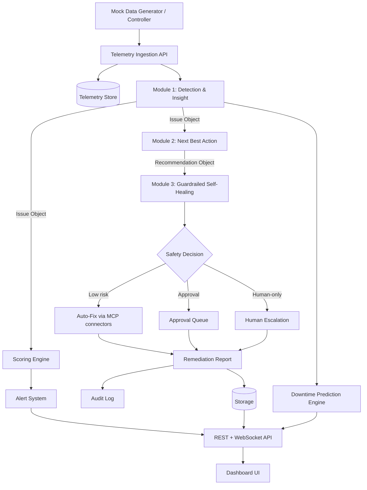

# 02 — High-Level Architecture

## 1. Core flow

```text
Detection & Insight → Next Best Action → Guardrailed Self-Healing
```

Each module takes structured input and emits structured output for the next. Around this flow sit
cross-cutting engines kept from the old spec: **Scoring**, **Alerts**, **Downtime Prediction**,
and the **Audit/Report** layer.

## 2. Layers

1. Live Mock Data Generator / Controller
2. Telemetry Ingestion API
3. **Module 1 — Detection & Insight** (Isolation Forest + rules + SHAP + LLM)
4. **Module 2 — Next Best Action** (rule NBA + XGBoost forecast + Optimization Impact Forecast)
5. **Module 3 — Guardrailed Self-Healing** (safety rules + runbooks + rollback + MCP connectors)
6. Cross-cutting: **Scoring Engine**, **Alert System**, **Downtime Prediction Engine**
7. Storage Layer
8. Audit & Reporting Layer
9. Dashboard UI (both heatmaps + tabs + workflow pages)

## 3. System diagram



## 4. Module-to-module data contracts

```text
Telemetry Object → Module 1 → Issue Object → Module 2 → Recommendation Object → Module 3 → Remediation Result + Report + Audit
```

Schemas are in `03_DATA_MODEL.md`.

## 5. ML placement (full stack)

| Purpose | Approach | Lives in |
|---|---|---|
| Anomaly detection | Isolation Forest | Module 1 |
| Explainability | SHAP / SHAP-style feature contribution | Module 1 |
| Issue classification | Rules (after anomaly) | Module 1 |
| User-facing wording | LLM (explanation only, never decisions) | Modules 1, 2, 3 |
| Cost/energy/carbon forecast | XGBoost Regressor (3 targets) | Module 2 |
| Recommendation | Rule-based NBA engine | Module 2 |
| Downtime forecast | Trend/degradation model | Downtime Prediction Engine |
| Safety decision | Rule engine (authoritative) | Module 3 |

**Rule:** the LLM never makes safety or action decisions. Those are deterministic rules.

## 6. Both heatmaps (decision: Both)

- **Composite grid (landing):** one box per workload, colored on a continuous green→red gradient by
  the weighted **Priority_Score** (0–100). Hover tooltip: name, score, status, top alert,
  **downtime risk**. Click → workload detail.
- **Dimension matrix (toggle):** rows = workloads, columns = **Security · Energy · Carbon · Cost ·
  Performance · Monitoring**, each cell green/yellow/red/gray. Click a cell → relevant issue/tab.

A toggle on the landing page switches between the two views over the same data.

## 7. Architectural decisions

1. **Event-driven internal comms** (asyncio queues / event bus) to decouple modules.
2. **Policy-as-data** — detection rules, recommendation rules, safety rules, runbooks, and scoring
   weights are JSON config, editable without code changes.
3. **Simulation-first** — all data sources behind provider interfaces; mock vs live is swappable.
4. **Single-process MVP** — all modules in one FastAPI process with background tasks.

## 8. Recommended tech stack

- **Frontend:** React 18 + TypeScript + Vite + Tailwind + Recharts + Lucide. (Prototype currently
  static HTML/Tailwind — port forward.)
- **Backend:** Python 3.11+ + FastAPI, REST + WebSocket.
- **ML:** scikit-learn (Isolation Forest), XGBoost, SHAP, pandas/numpy.
- **Storage:** SQLite (dev) → Postgres-ready. JSON for config/policies.
- **Connectors:** simulated MCP cloud/ticketing/notification/audit connectors.
